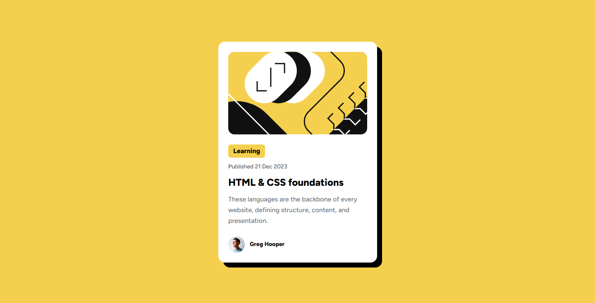

# Blog Preview Card

This is a solution to the **Blog Preview Card** challenge from [Frontend Mentor](https://www.frontendmentor.io).  
This project helped me practice building a responsive card layout and working with Tailwind CSS utilities.

---

## 📸 Screenshot

---

## 🔗 Links

- **Live Site:** https://your-live-site-url.com  
- **Repository:** https://github.com/your-username/blog-preview-card

---

## 🛠 Built With

- Tailwind CSS
- Mobile-first workflow
- Responsive layout
- Utility-first CSS
- Google Fonts (Figtree)

---

## 🎯 What I Learned

While working on this project, I learned how to:
- Build a simple card layout using Tailwind CSS
- Create a custom solid box-shadow similar to the design
- Make layouts responsive using mobile-first classes
- Use Google Fonts in a project

---

## ⚠️ Challenges

One of the challenges was recreating the exact shadow used in the design because it doesn’t use blur.  
I solved this by defining a custom shadow value in Tailwind CSS.

Another challenge was keeping the layout responsive, which I handled by testing the design on different screen sizes.

---

## 🚀 Future Improvements

In the future, I would like to:
- Improve accessibility using more semantic HTML
- Refactor the code to make components more reusable
- Practice writing cleaner and more readable Tailwind classes

---

## 🙏 Acknowledgments

Design by [Frontend Mentor](https://www.frontendmentor.io).  
Coded by **Zohre**.

---

## 👤 Author

- Frontend Mentor – https://www.frontendmentor.io/profile/Itszhrst 
- GitHub – https://github.com/Itszhrst
